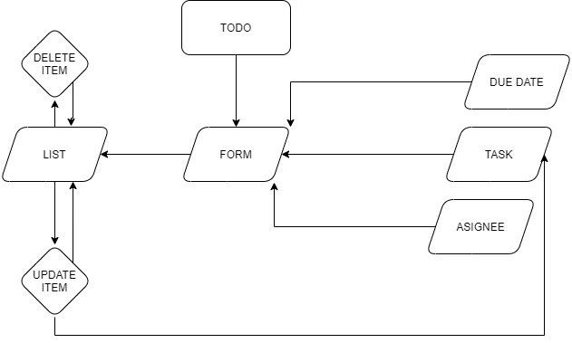

## Todo App

an application designed for creating and organizing a “To Do” list in your browser.

[Deployment](https://zen-benz-cc303e.netlify.app/)

## Technical Requirements

The application will be created with the following overall architecture and methodologies

- React
- ES6 Classes
- Settings delivered to the application using Context
- User Login & Permissions delivered to the application using Context
- Local Storage / Cookies for storing login status
- Local Storage / Cookies for storing user preferences
- Superagent or Axios for performing API Requests
- React Bootstrap for styling

## phase-1

- UML:
    

